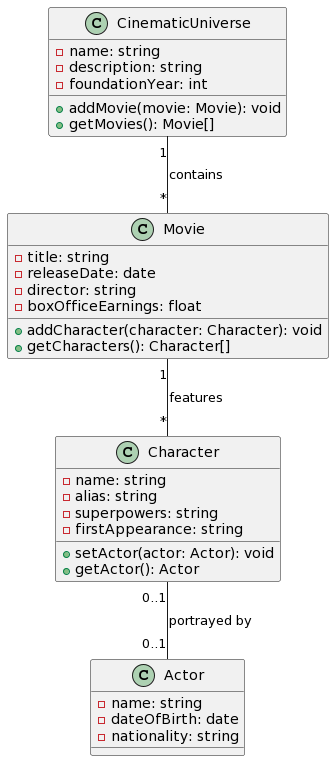

# Trial assesment

This repository contains a full-stack CRUD application showcasing a hobby-themed project,
developed using Laravel with Laravel Sail for the backend and a React frontend enhanced with TypeScript.

#### Table of contents
1. [Basic concept for the project](#basic-idea)
2. [Sail project requirements](#requirements)
3. [Installing the project](#install)
4. [Go through project adding new model](#show-project)

<a id="basic-idea"/>

### 1. Basic concept for the project
<p>The initial idea is quite simple, app should show movies timeline and a list of characters for each movie. The below diagram is a visualisation of the classes.</p>



<a id="requirements" />

### 2.Sail project requirements

To run this Laravel Sail project, ensure your system meets the following requirements:

- **Operating System**: Windows, macOS, or Linux.
- **Docker**: Docker Desktop for Windows or macOS, or Docker Engine for Linux.
    - Docker Compose should also be installed (usually comes with Docker Desktop).
- **PHP**: PHP 7.4 or higher (for running Composer commands locally, if not using Sail's CLI).
- **Composer**: Required for managing PHP dependencies.
- **Node.js and NPM**: (Optional) For managing Node dependencies and running build scripts for the frontend.

#### Additional Requirements for Windows Users
- **WSL2**: For Windows users, WSL2 (Windows Subsystem for Linux) is recommended for better performance.
- **Git**: For version control and cloning the repository.

#### Optional Tools
- **Git**: For version control (recommended for all users).
- **IDE/Code Editor**: Such as Visual Studio Code, PHPStorm, etc., for coding and debugging.
- **Web Browser**: Any modern web browser like Chrome, Firefox, Safari, or Edge.

**Note:** Laravel Sail runs the application in Docker containers, ensuring a consistent environment across different systems. However, having PHP and Composer installed locally can be helpful for running certain commands outside of Docker.

<a id="install" />

### 3. Installing the project
1. Clone the project
```shell
git clone git@github.com:rbaranowski86/laravel-cinematic-universe.git
```
2. Go into the folder and set .env file
```shell
cd laravel-cinematic-universe
cp .env.example .env
```
3. Since sail itself to be used is a part of the project, run one-time ugly docker command
```shell
docker run --rm -u "$(id -u):$(id -g)" -v "$(pwd):/var/www/html" -w /var/www/html  laravelsail/php82-composer:latest composer install --ignore-platform-reqs
```
4. Alias sail to be easier to use
```shell
alias sail='bash vendor/bin/sail'
```
5. Put down and up the environment
```shell
 sail down && sail up -d
```
6. Migrate DB
```shell
sail artisan migrate --seed
```
7. Test to be sure backend is fine
```shell
sail test
```
8. Setup Frontend
```shell
sail npm install
```
9. Launch frontend
```shell
sail npm run dev
```
10. Optionally to test frontend run in separate terminal while frontend is launched
```shell
alias sail='bash vendor/bin/sail'
sail artisan migrate:fresh --seed
npm test
```

**Note:** Notice that actually only frontend test requires to use npm locally, all the other commands are being run inside container

### 4. Go through project by adding a new model
Now lets do something that will help us understand the project (dis)organisation. Lets separate 
1. Create new migation
```shell
sail artisan make:migration create_directors_table
```
2. Edit generated schema to
```php
Schema::create('directors', function (Blueprint $table) {
        $table->id();
        $table->string('name');
        $table->timestamps();
    });
```
3. Create another migration to modify movie table
```shell
sail artisan make:migration modify_movies_table_for_directors
```
4. Edit the schema
```php
Schema::table('movies', function (Blueprint $table) {
        $table->foreignId('director_id')->after('releaseDate')->nullable()->constrained('directors')->onDelete('set null');
    });
```
5. Migrate both changes
```shell
sail artisan migrate
```
6. Create model for Director to continue with moving names
```shell
sail artisan make:model Director
```
and add the code to Models\Director:
```php
<?php

namespace App\Models;

use Illuminate\Database\Eloquent\Model;
use Illuminate\Database\Eloquent\Factories\HasFactory;

class Director extends Model
{
    use HasFactory;

    protected $fillable = ['name'];

    public function movies()
    {
        return $this->hasMany(Movie::class);
    }
}

```
finally establish relation in the Movie:
```php
public function director()
    {
        return $this->belongsTo(Director::class);
    }
```
and update fillables:
```php
protected $fillable = ['title', 'releaseDate', 'director_id', 'boxOfficeEarnings', 'cinematic_universe_id'];
```

7. Migrate the data
```shell
sail artisan make:migration move_directors_from_movie_to_director_table
```
and paste:
```php
<?php

use Illuminate\Database\Migrations\Migration;
use Illuminate\Database\Schema\Blueprint;
use Illuminate\Support\Facades\Schema;
use App\Models\Movie;
use App\Models\Director;

return new class extends Migration
{
    /**
     * Run the migrations.
     */
    public function up(): void
    {
        $movies = Movie::all();

        foreach ($movies as $movie) {
            // Create or find the director
            $director = Director::firstOrCreate(['name' => $movie->director]);

            // Update the movie with the director_id
            $movie->director_id = $director->id;
            $movie->save();
        }
    }

    /**
     * Reverse the migrations.
     */
    public function down(): void
    {
    }
};
```
8. Remove the column
```shell
sail artisan make:migration remove_director_from_movies_table
```
and paste:
```php
Schema::table('movies', function (Blueprint $table) {
    $table->dropColumn('director');
});
```
9. Run the migrations to sort out changes
```shell
sail artisan migrate
```
10. Correct seeders to not break and seed directors properly
Create DirectorSeeder
```shell
sail artisan make:seeder DirectorSeeder
```
and add the code
```php
<?php

namespace Database\Seeders;

use App\Models\Director;
use App\Models\Movie;
use Illuminate\Database\Seeder;

class DirectorSeeder extends Seeder
{
    /**
     * Run the database seeds.
     */
    public function run(): void
    {
        $moviesWithDirectors = [
            ['title' => 'Iron Man', 'director' => 'Jon Favreau'],
            ['title' => 'Thor', 'director' => 'Kenneth Branagh'],
            ['title' => 'Captain America: The First Avenger', 'director' => 'Joe Johnston'],
            ['title' => 'The Avengers', 'director' => 'Joss Whedon'],
            ['title' => 'Guardians of the Galaxy', 'director' => 'James Gunn'],
            ['title' => 'Avengers: Age of Ultron', 'director' => 'Joss Whedon'],
            ['title' => 'Captain America: Civil War', 'director' => 'Anthony and Joe Russo'],
            ['title' => 'Doctor Strange', 'director' => 'Scott Derrickson'],
            ['title' => 'Black Panther', 'director' => 'Ryan Coogler'],
            ['title' => 'Avengers: Infinity War', 'director' => 'Anthony and Joe Russo'],
            ['title' => 'Avengers: Endgame', 'director' => 'Anthony and Joe Russo']
        ];

        foreach ($moviesWithDirectors as $movieWithDirector) {
            $director = Director::firstOrCreate([
                'name' => $movieWithDirector['director']
            ]);

            Movie::where('title', $movieWithDirector['title'])
                ->update(['director_id' => $director->id]);
        }
    }
}
```
and let's correct MovieSeeder loop in the easiest way:
```php
foreach ($movies as $movie) {
            unset($movie['director']);
            $mcu->movies()->create($movie);
        }
```
and remember to add DirectorSeeder into DatabaseSeeder:
```php
<?php

namespace Database\Seeders;

use Illuminate\Database\Seeder;

class DatabaseSeeder extends Seeder
{
    /**
     * Seed the application's database.
     */
    public function run(): void
    {
        $this->call(CinematicUniverseSeeder::class);
        $this->call(MovieSeeder::class);
        $this->call(CharacterSeeder::class);
        $this->call(ActorSeeder::class);
        $this->call(DirectorSeeder::class);
    }
}
```
also we can correct now Movie Model:
```php
protected $fillable = ['title', 'releaseDate', 'director_id', 'boxOfficeEarnings', 'cinematic_universe_id'];
```
And try it out:
```shell
sail artisan migrate:fresh --seed
```
11. Lets run some tests
```shell
sail test
```
Of course some of them don't work. Tests use Factories to create dummy objects.<br/>
Creating Director Factory:
```shell
sail artisan make:factory Director 
```
Replace definition with:
```php
public function definition(): array
    {
        return [
            'name' => $this->faker->name,
        ];
    }
```
and let's correct Movie Factory definition:
```php
public function definition()
    {
        return [
            'title' => $this->faker->sentence,
            'releaseDate' => $this->faker->date,
            'director_id' => Director::factory()->create()->id,
            'boxOfficeEarnings' => $this->faker->randomFloat(2, 1000000, 100000000),
            'cinematic_universe_id' => CinematicUniverse::factory()->create()->id,
        ];
    }
```
Rerun the tests now:
```shell
sail test
```
Only one broken. Not too bad. To fix Movie store test replace the director with director_id similar way as in Factory:
```php
'director_id' => Director::factory()->create()->id,
```
Rerun that specific test again:
```shell
sail test tests/Feature/MovieControllerTest.php --filter test_store
```
Now in the errors we can see `The director field is required.` where is it coming from? Of course StoreMovieRequest.php
And then next one will show that the director_id is null, so we will head to MovieResource... 
and finally ...
```shell
sail test
```
I hope it works! But it seems like underestimated the lists of steps to produce whole new endpoint. So lets just finnish it with adding to Resource some compatibility tweak:
```php
'director' => Character::findOrFail($this->director_id)->name,
```

